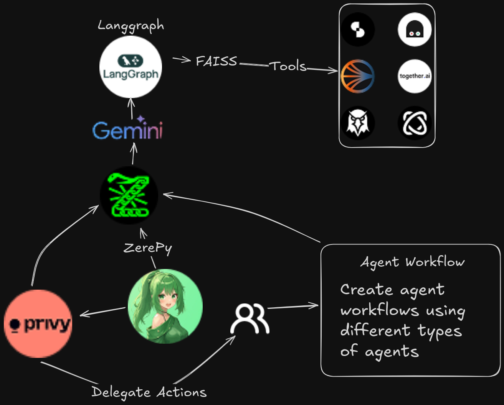

# Overview

Shiami is a powerful DeFAI chatbot and an autonomous AI agent swarm supervisor, designed to manage DeFi tasks through natural language. It seamlessly provides access to major SonicLabs DeFi protocols with ease.

Shiami provides seamless access to over $500M worth of protocols on Sonic—all within a single application

<figure><figcaption></figcaption></figure>

### Learn more

<table data-view="cards"><thead><tr><th></th><th></th><th data-hidden data-card-cover data-type="files"></th><th data-hidden></th><th data-hidden data-card-target data-type="content-ref"></th></tr></thead><tbody><tr><td><strong>Getting Started</strong></td><td>Learn how to use Shiami</td><td></td><td></td><td><a href="broken-reference">Broken link</a></td></tr><tr><td><strong>Architecture</strong></td><td>What happens under the hood?</td><td></td><td></td><td><a href="technical-details/architecture.md">architecture.md</a></td></tr><tr><td><strong>Agent Workflows</strong></td><td>Automate your tasks with a few clicks</td><td></td><td></td><td><a href="getting-started/what-can-shiami-do/agent-workflows.md">agent-workflows.md</a></td></tr><tr><td><strong>Silo Finance</strong></td><td>Access SIlo Pools using Shiami</td><td></td><td></td><td><a href="broken-reference">Broken link</a></td></tr><tr><td><strong>Beets Dashboard</strong></td><td>Everything about Beets on Shiami</td><td></td><td></td><td><a href="broken-reference">Broken link</a></td></tr></tbody></table>
