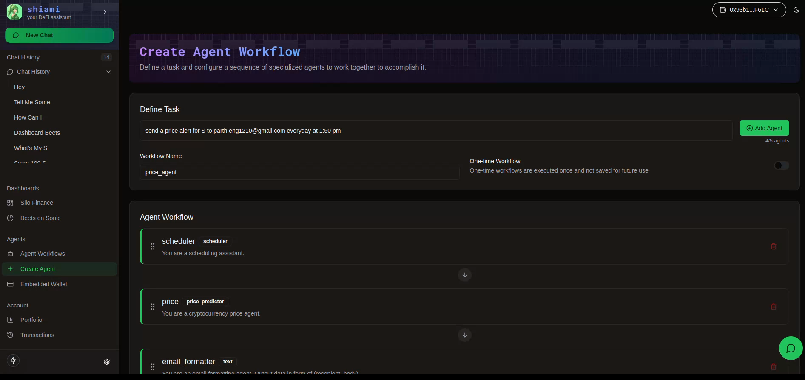

# Agent Workflows

<figure><figcaption>
<a href="https://www.shiami.me/dashboard/create-agent">https://www.shiami.me/dashboard/create-agent</a>
</figcaption></figure>

### Create Agent Workflows

1. (Optional) Delegate your Privy Embedded Wallet for allowing Shiami to execute transactions on your behalf

<figure><figcaption></figcaption></figure>

2.  Navigate to the Create Agent page and create your agent workflow

    Example Workflow -

    1. Current Task - Send a price alert for EGGS token to chat@shiami.me everyday at 5pm
    2. Agents this would require - Scheduler, Price Agent, Email Formatting Agent(text), Email agent
3. After successful creation, you can view your agent under the Agent Workflows section.

<figure><figcaption></figcaption></figure>

4. You can also assign new tasks to your existing agent workflows through the 'chat' option
