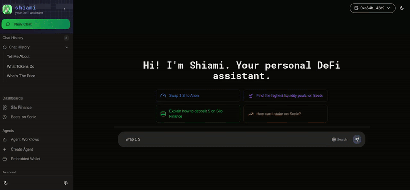
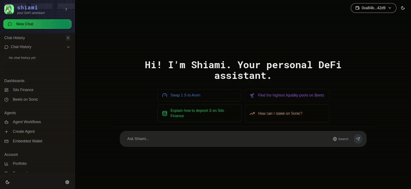
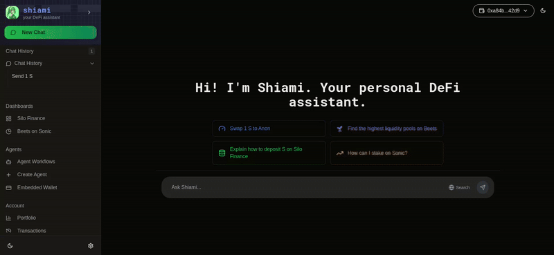

# Basic Operations

### Your holdings

Check your holdings on the Sonic Mainnet - Powered by [sonicscan.org](https://sonicscan.org)

Ex - What tokens do I have in my wallet?

or What's my USDC balance?

<figure><figcaption></figcaption></figure>

### Your transactions

Check your transactions - Powered by [sonicscan.org](https://sonicscan.org)

Ex - What are the recent transactions for my wallet?

<figure><figcaption></figcaption></figure>

### Token Prices

Get prices of the tokens available on Sonic Mainnet - Powered by DexScreener

Ex - What's the price of EGGS tokens?

<figure><figcaption></figcaption></figure>

### Wrap S

Ex - Wrap 1 S

<figure><figcaption></figcaption></figure>

### Token Transfers

Transfer S and ERC20 on Sonic Mainnet.\
Ex - Send 1 Anon to 0x...342

<figure><figcaption></figcaption></figure>

### Token Swaps

Swap tokens within the Sonic Network - Powered By KyberSwap Aggregator

Ex - Swap 1 S to USDC

or, Swap 1 EGGS to USDC with 2% slippage

<figure><figcaption></figcaption></figure>

