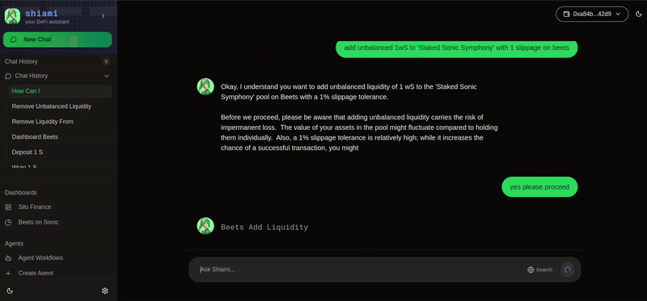

# Beets on Sonic

### Beets On Sonic Board

1. Browse through different Beets pools using a dedicated Beets Dashboard.
2. Got some questions? Add any pool to the context and ask questions from Shiami

<figure><figcaption>
<a href="https://www.shiami.me/dashboard/beets">https://www.shiami.me/dashboard/beets</a>
</figcaption></figure>

### Analyze Pools

View your positions and other details about pools on the Details Page.

<figure><figcaption>
<a href="https://www.shiami.me/dashboard/beets/0x374641076b68371e69d03c417dac3e5f236c32fa000000000000000000000006">https://www.shiami.me/dashboard/beets/0x374641076b68371e69d03c417dac3e5f236c32fa000000000000000000000006</a>
</figcaption></figure>

### Pool Operations

1.  **Query through different pools -**

    Examples -&#x20;

    "Show me all Beets pools"

    "List the top 5 Beets pools sorted by APR"

    "Find the highest liquidity pools on Beets"

    "Search for 'ETH' pools on Beets"

    "Tell me some USDC pools on Beets."\

2.  **Stake S on Beets -**

    Examples -

    "Stake 100 SONIC tokens"

    "I want to stake SONIC"

3.  **Undelegate staked SONIC(stS) shares from the pool -**

    Examples -

    "Undelegate 50 stS"

    "Start the withdrawal process for my staked SONIC"

    "I want to undelegate my SONIC stake"\

4.  **Withdraw undelegated SONIC tokens -**

    Examples -\

    "I want to finalize my SONIC withdrawal with ID 123"\

5.  **Get staking information for a user -**

    Examples -

    "Show my SONIC staking information"

    "Check my staked SONIC balance"

    "Get details about my SONIC staking position"\

6.  **Add liquidity to a Beets pool -**

    Examples -

    \

    "I want to add 100 THC of proportional liquidity to Beets pool 'Conspiracy Concerto' with 0.5% slippage".

    "Add unbalanced liquidity with 200 THC and 0.5 stS to Beets pool 'Conspiracy Concerto' with 1% slippage"

    "Add unbalanced liquidity with 200 THC to Beets Pool 'Conspiracy Concerto' with 1% slippage".&#x20;

    "Provide DAI single token liquidity to Beets pool 'Conspiracy Concerto' to get 10 BPT".

    "Add boosted proportional liquidity with 500 THC amount to pool 'Conspiracy Concerto' using THC and stS tokens"\

7.  **Remove liquidity from a Beets pool -**

    Examples -

    \

    "I want to withdraw 10 BPT proportionally from Beets pool 'Conspiracy Concerto' with 0.5% slippage"

    "Remove 15 BPT from Beets pool 'Conspiracy Concerto' and get USDC in return".

    "Take out exactly 500 stS from my liquidity in Beets pool 'Conspiracy Concerto'".\
    "Remove unbalanced 1wS from 'Staked Sonic Symphony'"

    "Withdraw 20 BPT with boosted proportional strategy from 'Conspiracy Concerto' pool"\

8.  **Swap using Beets**

    Examples -

    \
    "I want to swap 10 stS for USDC.e on Beets with 0.5 percent slippage"

<figure><figcaption></figcaption></figure>

