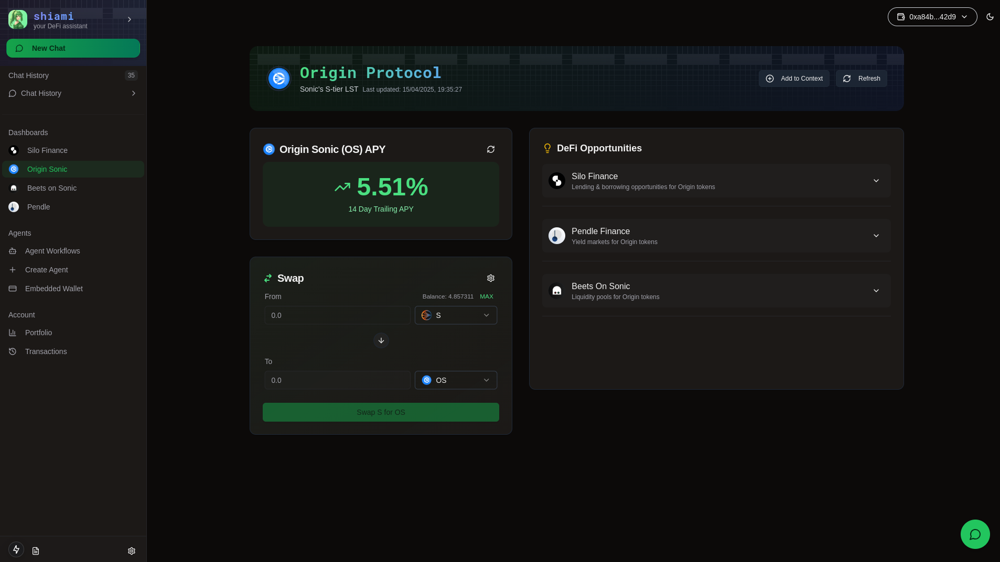

# Origin Sonic

### Origin Dashboard

1. Swap supported tokens to OS/wOS and vice-versa powered by KyberSwap
2. Browse DeFi opportunities that use Origin tokens on Silo, Pendle and Beets.fi
3. Interact with these DeFi protocols directly through the Shiami Origin Dashboard

<figure><figcaption><p><a href="https://app.shiami.me/dashboard/origin">https://app.shiami.me/dashboard/origin</a></p></figcaption></figure>

### Chat Operations

**Staking for OS**

<pre><code><strong>Stake 1 S on Origin Protocol
</strong></code></pre>

or

```
Swap 1 USDC.e for OS
```

**Wrap OS tokens**

```
Wrap 1 OS
```

**Fetch 14 Day Trailing  APY for OS**

```
What is the current APY for Origin Sonic token?
```
