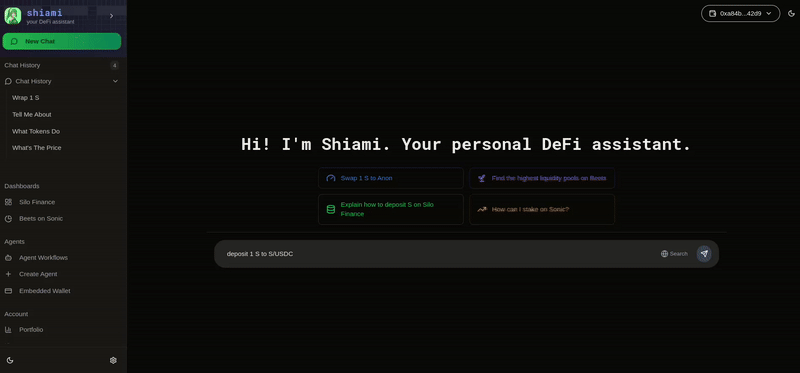

# Silo Finance Operations

### Silo Dashboard

1. Browse through different Silo Markets using a dedicated Silo Dashboard.
2. Got some questions? Add any market to the context and ask questions from Shiami

<figure><figcaption>
<a href="https://www.shiami.me/dashboard/silo">https://www.shiami.me/dashboard/silo</a>
</figcaption></figure>

### Silo Deposit

Deposit protected/collateral-based assets to Silo Markets.

Ex - deposit Collateral 1000 USDC into Sonic/USDC pair

or, deposit Protected 100 Sonic into Sonic/USDC pair

<figure><figcaption></figcaption></figure>

### Silo Position Details

View your position details for a specific Silo Market.

Ex - get my position details for S/USDC pair

<figure><figcaption></figcaption></figure>

### Other Operations

Shiami also supports withdraw, repay, and borrow.

You can also use the dashboard solely for interacting with the Silo markets

<figure><figcaption>
<a href="https://www.shiami.me/dashboard/silo/20">https://www.shiami.me/dashboard/silo/20</a>
</figcaption></figure>
