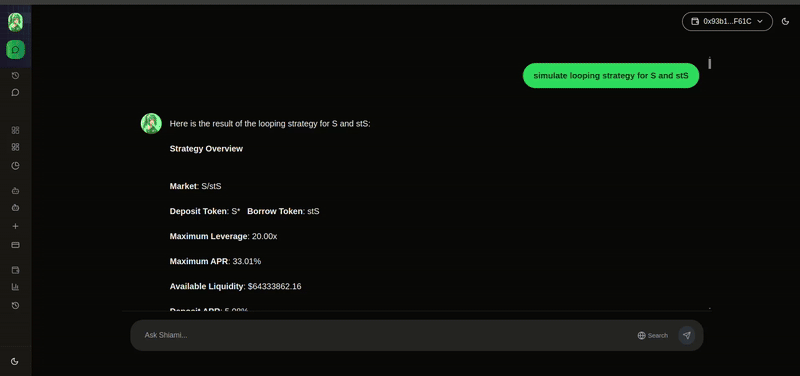
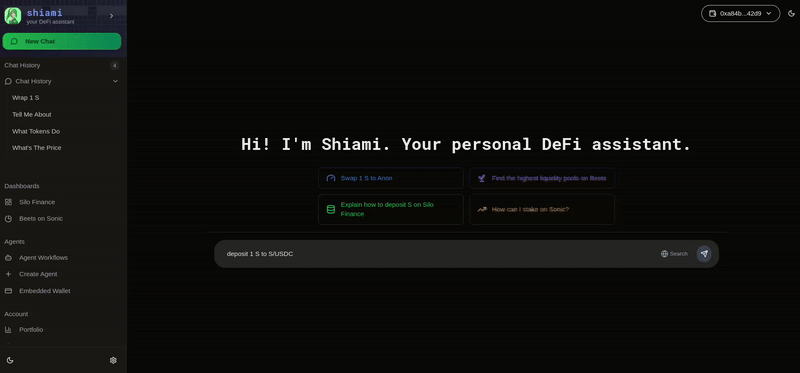

# Silo Finance Operations

### Silo Dashboard

1. Browse through different Silo Markets using a dedicated Silo Dashboard.
2. Got some questions? Add any market to the context and ask questions from Shiami

<figure><figcaption>
<a href="https://www.shiami.me/dashboard/silo">https://www.shiami.me/dashboard/silo</a>
</figcaption></figure>

### Finding Looping Opportunities

You can use Shiami for finding looping strategies using Silo Markets. It also returns a yield table which simulates the strategy.&#x20;

Best Part - It is very easy to use and understand

Example - "simulate looping strategy for S and stS" or "find top 5 looping strategies on Silo Finance"

Works like a charm✨

<figure><figcaption></figcaption></figure>

### Silo Deposit

Deposit protected/collateral-based assets to Silo Markets.

Ex - deposit Collateral 1000 USDC into Sonic/USDC pair

or, deposit Protected 100 Sonic into Sonic/USDC pair

Optional Argument - Market ID

<figure><figcaption></figcaption></figure>

### Silo Position Details

View your position details for a specific Silo Market.

Ex - get my position details for S/USDC pair

Optional Argument - Market ID

<figure><figcaption></figcaption></figure>

### Other Operations

Shiami also supports withdraw, repay, borrow or claim rewards.

You can also use the dashboard solely for interacting with the Silo markets

You can also filter markets by tokens, ex - "get Silo markets for Sonic and USDC"

<figure><figcaption>
<a href="https://www.shiami.me/dashboard/silo/20">https://www.shiami.me/dashboard/silo/20</a>
</figcaption></figure>
